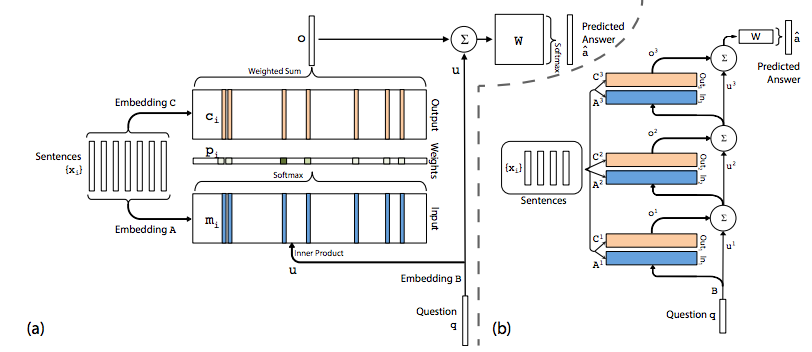

# QA_System
Data: The (20) QA bAbI tasks, get from <https://research.fb.com/projects/babi/>
 
Example:  
1 Sandra travelled to the kitchen. 
2 Sandra travelled to the hallway. 
3 Where is Sandra? 	hallway	2 
 
load_data.py	-> Data preprocessing: Remove punctuation, extract story, question, answer part respectively.  Convert data into number-representation vector.
 
memn2n.py	-> End-to-End Memory Network Model. 
Position Encoding: Try to capture the word order information in a sentence. 
Temporal Encoding: Many of the QA tasks require some notion of temporal context, e.g. the model needs to understand that Sam is in the bedroom after he is in the kitchen.
 
result.ipynb	-> Train model, get classification accuracy about training data, validation data and test data.
 

 
Reference: End-To-End Memory Networks, Sainbayar Sukhbaatar, 2015

