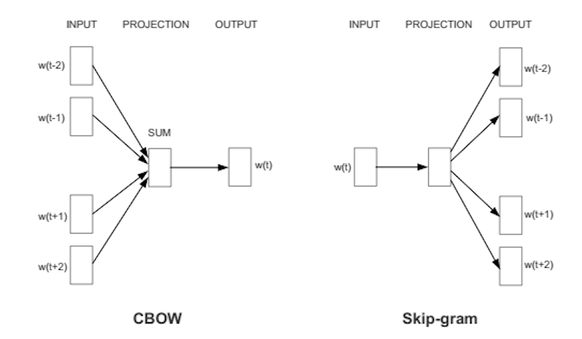
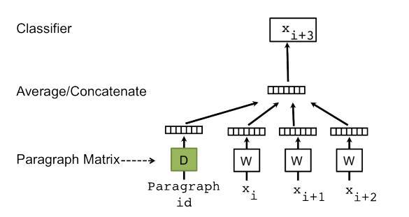

# Sentiment Analysis
Data: IMDB movie reviews [provided by Kaggle]  
Including 25,000 labeled review, 50,000 unlabeled review, 25,000 test set.
 
 
1. <b>tf-idf feature model</b> [bag of words]  
    Random Forest, accuracy: 0.94609  
    Naive Bayes + SGDClassifer, accuracy: 0.967  
     
2. <b>Word2Vec model</b> [5000features_40minwords_10context]  
    Random Forest, accuracy: 0.93  
    After calculate the word embedding matrix, can go further by using K-Means so as to divide words into different categories (e.g. animal, divide, weather, etc). Represent each review with combination of categories, then train ML model.
     
    
     
     
3. <b>Doc2Vec model</b> [500features_1minwords_10context]  
    Logistic Regression, accuracy: 0.93169  
    Comparing with Word2Vec, the only differences is adding different specific document label to sentences in different reviews. Every paragraph is mapped to a unique vector, this paragraph token keeps the topic of the paragraph. At prediction, perform an inference step to compute the paragraph vector as the final feature. 
    
    
