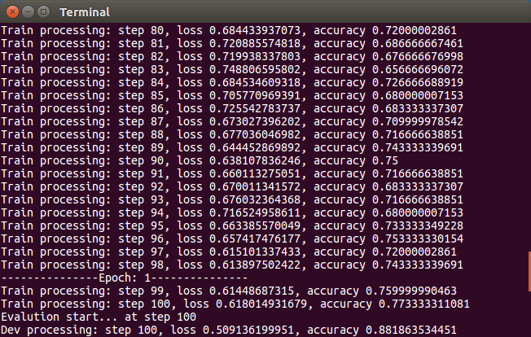
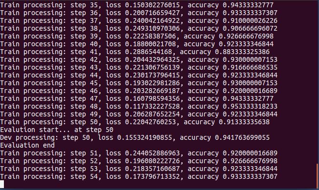

# news_topic_classification

Data source: Sogou Labs news corpus

Data Format: news_url, page_ID, page_title, page_content (all included in HTML label)

Classification Label: auto, health, sport, technology, etc.

Firstly clean the raw data to standard format so as to accepted by Tensorflow. Limited by computer capacity, select three sub-topics: auto, health and business, each of topics includes 10,000 data.

Set training parameters epoch_size, batch_size, embedding_size, drop_out_probability, train_test_split_ratio and CNN parameters filter_size, filter_num.

Data pre-processing would take 3 minutes.

CNN is so fast that takes only 2 minutes to finish 50 train steps and get an accuracy of 88% on test data after one epoch.

Set RNN parameters hidden_size(memory_size).

RNN is relative slower, it takes 4 minutes to finish 50 train steps, but it gets accuracy around 90% just after a few train steps and attains 94.2% accuracy on test data after half epoch.

CNN performs very good in computer vision because it ignore object positions and extract local feature. In natural language processing, RNN simulates human’s from-left-to-right reading habit but CNN smooth and ignore word order, that’s why RNN has higher accuracy.
